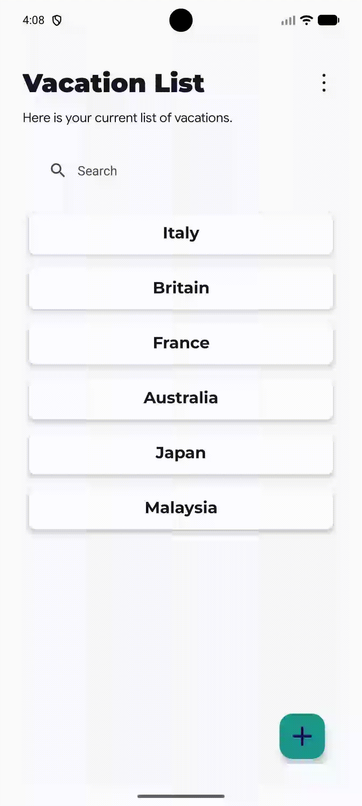
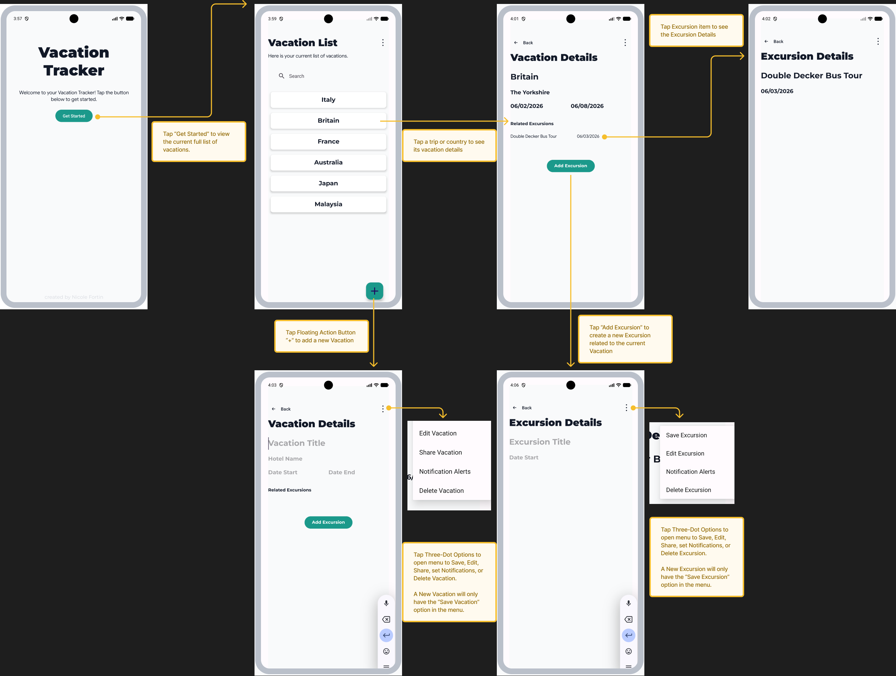
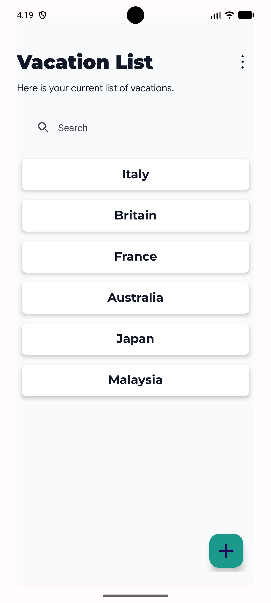
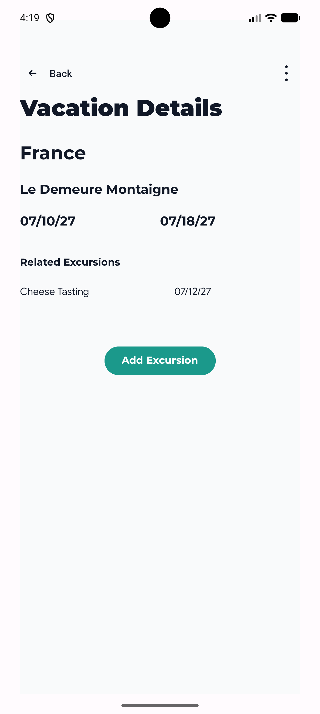
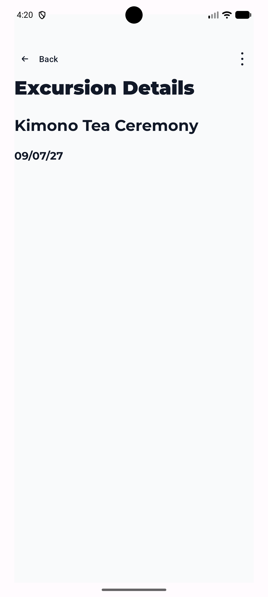
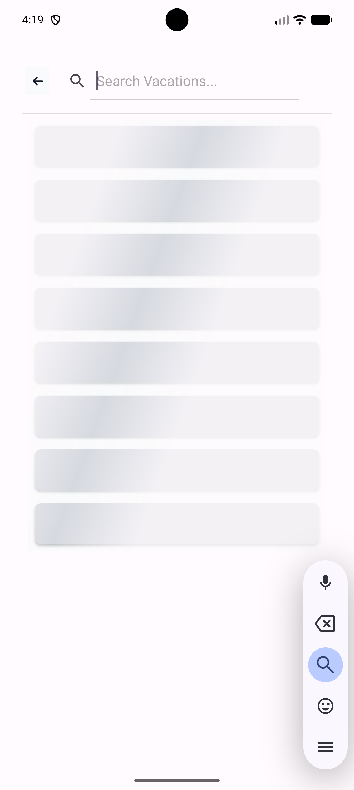

# Student Work - SOFTWARE ENGINEERING CAPSTONE

## Android Mobile Vacation Tracker 
This is a multiple-screen application that allows users to Create, Read, Update, and Delete vacation and excursion data. Users can keep track of details such as trip dates and hotel information. This application utilizes a local SQLite Database with the Room Framework. 

This project represents the culmination of my Software Engineering Bachelor's curriculum of full-stack development, creating an intuitive, user-friendly front-end interface with a complex backend logic.

## Table of Contents
- [The Project](#the-project)
- [Media](#media)
- [Tech Stack](#tech-stack)
- [Author](#author)

## The Project
Designed and developed a full-stack CRUD Android mobile application for planning and managing vacation trips and excursions. The app features a Room Database backend with a DAO/Repository architecture for local data persistence, a card-based RecyclerView UI, and input validation with date formatting enforcement.

Key features include:

- Full CRUD operations for vacations and linked excursions with relational database integrity
- AlarmManager-based push notifications triggered on vacation and excursion start/end dates
- Real-time search with shimmer loading animation and alphabetical sort functionality
- Delete validation preventing removal of vacations with associated excursions
- Android Intent-based sharing to automatically populate vacation details across apps
- Unit and instrumented testing using JUnit4 with an in-memory Room database

Deployed via Google Play Console Internal Test Track.

## Media

## Tech Stack
- Android Studio IDE
- Java Language with Gradle
- Room Database with DAO/Repository architecture
- RecyclerView and AlarmManager
- Facebook Library Shimmer

## Author
- LinkedIn - [Nicole Fortin](www.linkedin.com/in/nicole-fortin-3530b9211)

